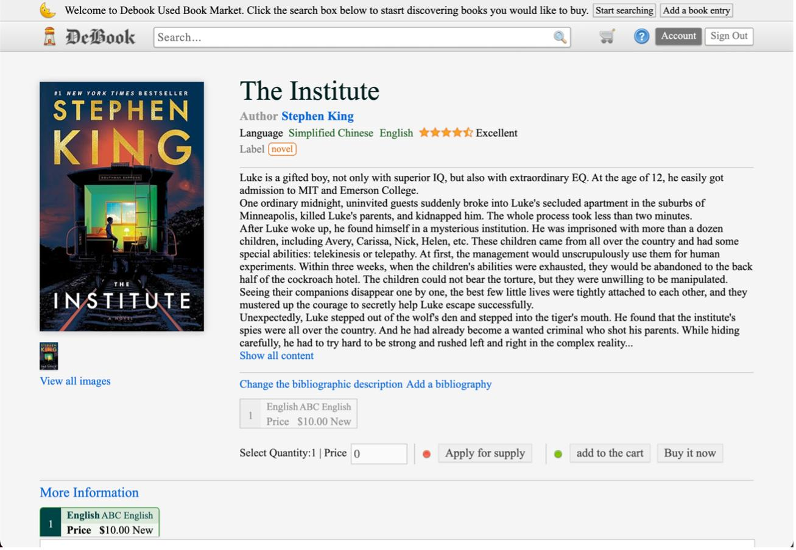
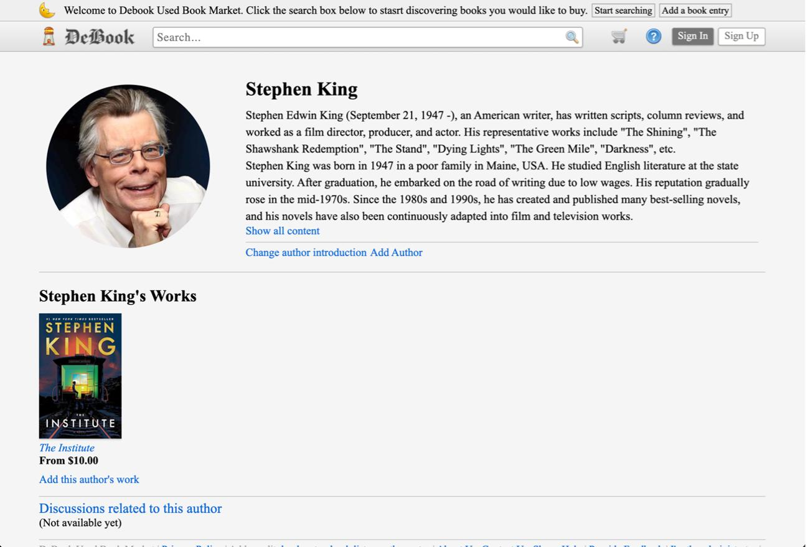
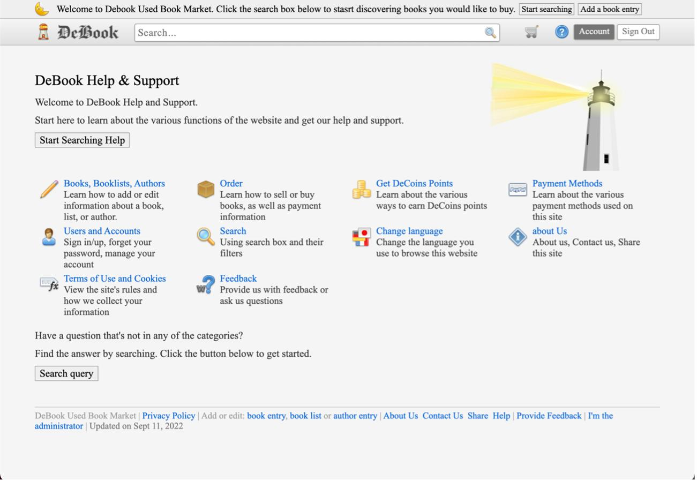

# DeBook
This is a used book marketplace built with PHP, JavaScript, and HTML, powered by a MySQL database.

## Demo
|Content|Image|
|-|-|
|
Book Page
||
|
Author Page
||
|
Help Page
||

## Deploying DeBook
- PHP 7.0 or above
- MariaDB or MySQL
- Any HTTP Server (Apache Httpd and Nginx are recommended)

## Attribution
- **Image on Main Page** is a modified version of [*Several book spines displayed on a shelf* by Johannes Jansson](https://commons.wikimedia.org/wiki/File:Urval_av_de_bocker_som_har_vunnit_Nordiska_radets_litteraturpris_under_de_50_ar_som_priset_funnits_(2).jpg)
